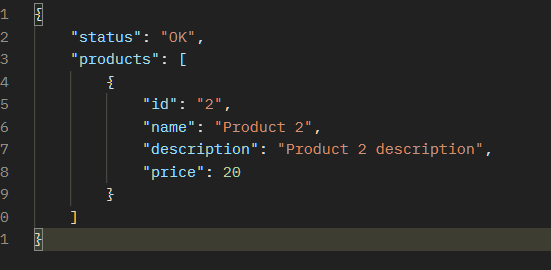
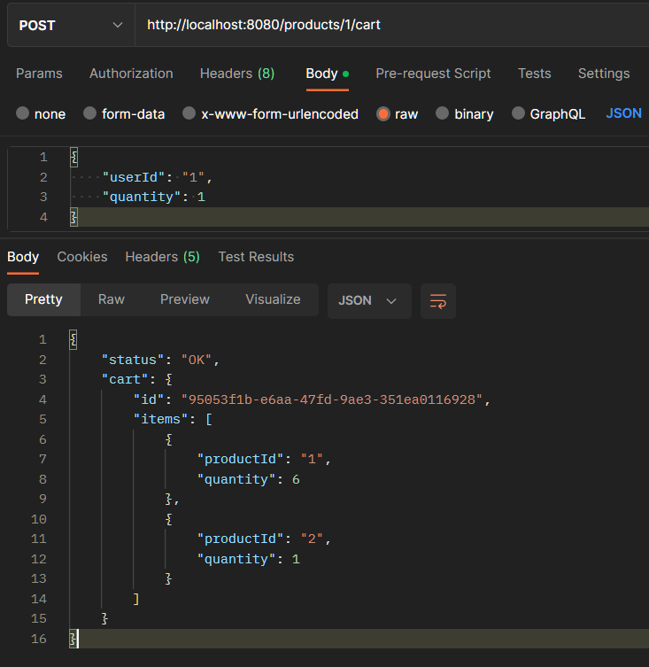
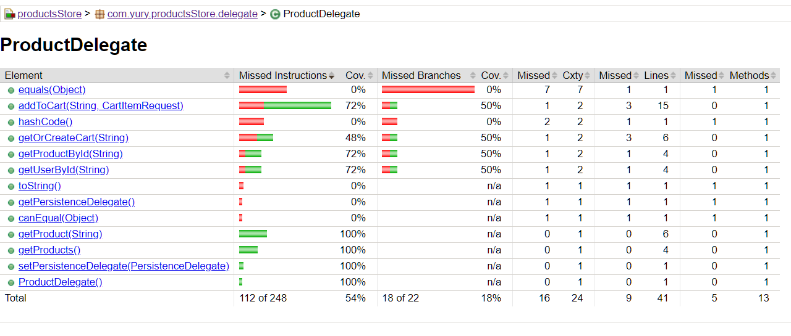

# ProductsStore
 E-Commerce app which allows users to view products, see product details and add products to a cart.

This application uses spring boot, mongodb Atlas cloud so that you can run it right away.

To start follow these steps:

1) Install maven 3, java 11
2) Open productsStore folder and run this command in console: mvnw spring-boot:run
3) Use postman to call the GET endpoint to see all products: http://localhost:8080/products
4) Use postman to call the GET endpoint to see product details by id: http://localhost:8080/products/1

Here is the sample json response which will be returned:

5) Use postman to call the POST endpoint to add products to user cart: http://localhost:8080/products/1/cart

and send request body as such:
{
"userId": "1",
"quantity": 3
}

This request will add 3 items of product 1 to a user cart with user id = 1;

Example:

To check the jacoco coverage report run "mvn clean package", after build is complete go to target\site\jacoco\
As you can see business logic located in our ProductsDelegate is mostly covered
(except for some methods which are generated by lombok)

One way to improve the application is to return specific messages when user input is invalid. 
For example now in add to cart request if you try to add a negative quantity you will get a generic error message
